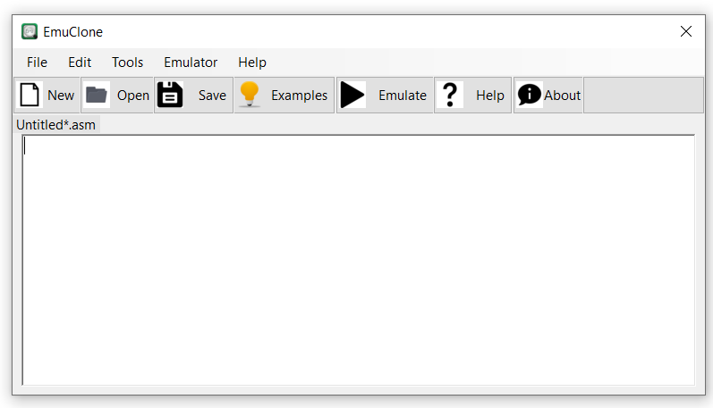
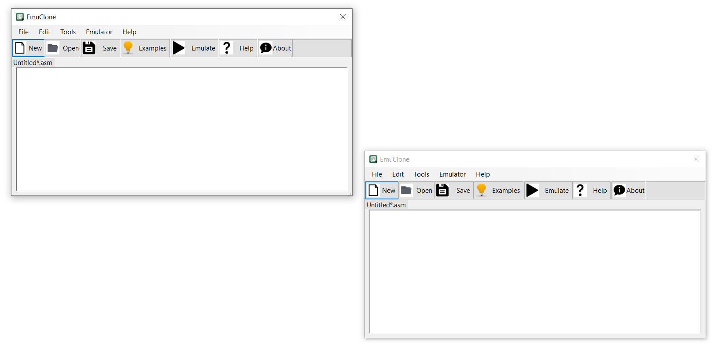
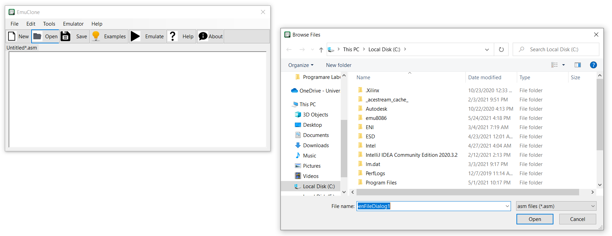
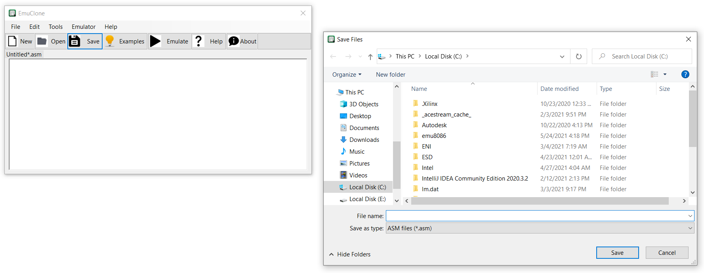
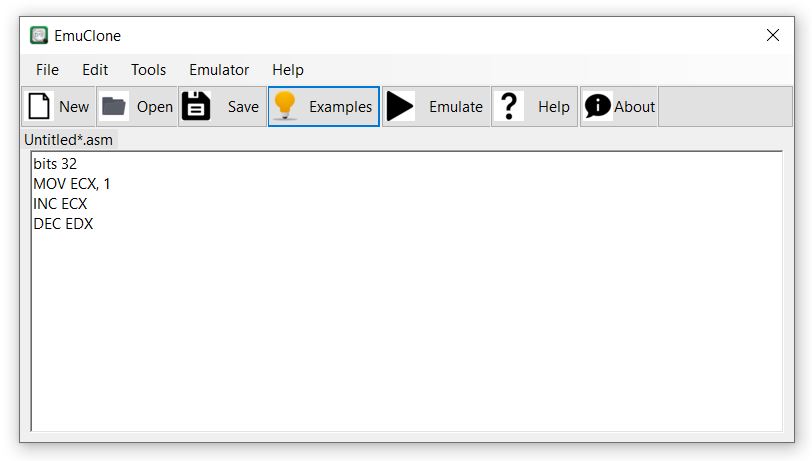
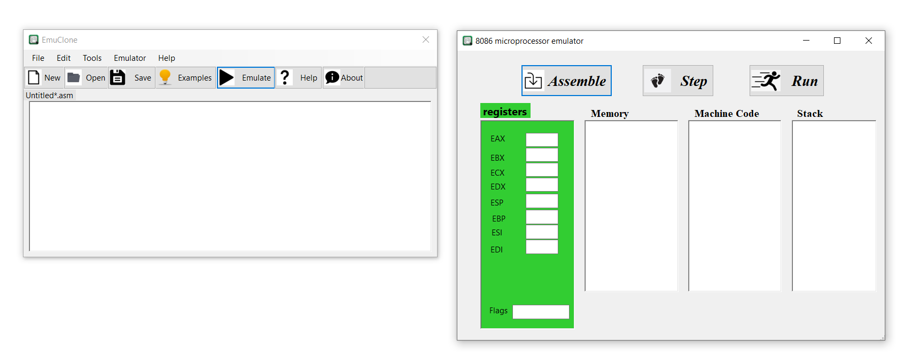
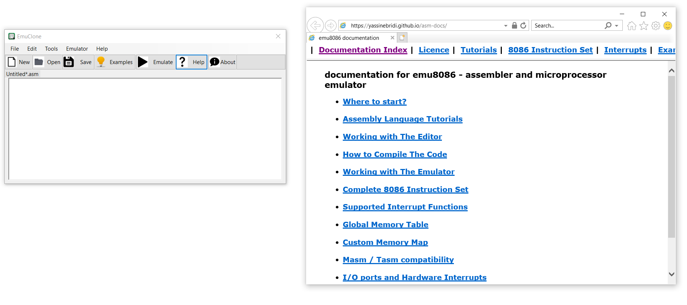
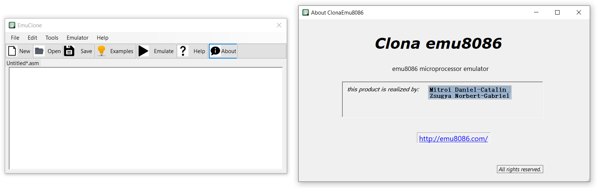
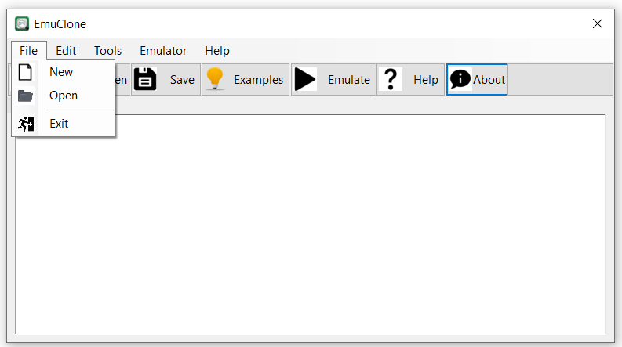

Clona EMU8086 
 
Studenti: Mitroi Daniel-Catalin 331AA & Zsugya Norbert-Gabriel 331AA

Descriere functionalitati:
---------------------
	- Programul va putea sa asambleze si sa ruleze cod pentru Intel8086 bazandu-ne pe biblioteca Unicorn si pe un asamblor(exemplu nasm).
	- Programul va contine o interfata minimala care va afisa: valorile din registrii, editor de text, butoane pentru diverse comenzi.

 Acesta este meniul principal al aplicatiei:
---------------------

In continuare vom prezenta functionalitatea fiecarui buton in parte:
---------------------

Butonul new are rolul de a deschide inca un meniu.
 

 
Butonul open are rolul de a deschide un fisier asm.
 

 
Butonul save are rolul de a salva fisierul asm.	
 

 
Butonul examples afiseaza o lista cu exemple.
 

 
Butonul emulate deschide o noua pagina in care putem asambla codul, putem rula codul sau putem rula pas cu pas. 
 

 
Butonul help ne directioneaza catre pagina web cu documentatia emu8086.
 

 
Butonul about prezinta informatii cu caracter general despre aplicatie.
 

 

Totodata avem si bara de meniu care cuprinde printre altele si aceste butoane deja prezentate.
---------------------
 

Instructiuni de compilare
---------------------

Aplicatia poate fi rulata pe un sistem de operare Windows folosind executabilul EmuClone.exe.Pentru a putea utiliza aplicatia ca developer va trebui sa atasezi cele 2 librarii . Acestea sunt "Gee.External.Capstone.dll" si "UnicornManaged.dll". Se va folosi .Net 5.0. Bibliotecile se gasesc in folderul bin. Pentru a importa bibliotecile in proiect,mergem in Solution Explorer selectam Dependencies, apoi Assemblies si le adaugam aici. Totodata va trebui sa instalam FSharp.Core(5.0.0). Vom face lucrul acesta mergand tot in Solution Explorer si selectam Manage NuGet Packeges. Aici introducem acest nume si dam cautare, dupa care il vom instala.

In cazul in care nu se gasesc bibliotecile in folderul bin se poate descarca exemplul de la care am plecat si se pot compila manual instaland in prealabil FSharp.Core(5.0.0).

_Pentru a beneficia de toate functiile aplicatiei trebuie instalat asamblorul nasm pentru Windows.(https://www.nasm.us/). Verificati ca nasm sa fie adaugat la Path, la EnviromentVariables. Acest asamblor ne ajuta sa asamblam in format binar cod x86, care mai apoi poate fi emulat._

**Nu uitati ca la final sa adaugati unicorn.dll in folderul bin/Debug, in caz ca nu exista acolo.** 

Exemplu de utilizare
---------------------

Se poate pleca de la exemplul implementat in aplicatie sau se poate scrie in editorul de text codul assembly dorit. Apoi se salveaza fisierul .asm si se poate emula codul. Se va deschide o noua fereastra in care mai intai se va asambla codul salvat, iar apoi utilizand facilitatea de rulare pas cu pas se poate face debugging urmarind valorile din registre dar si din memoria stack. Se poate folosi si butonul de run pentru a rula direct tot codul.

Fisierul .bin generat in urma asamblarii poate fi rulat folosind o masina virtuala spre exemplu(Qemu).

Pentru a putea genera direct cod pe 32 biti(fara sa fie introdusi octeti suplimentari), aveti grija ca in fisierele .asm pe care le scrieti sa introduceti la inceput "bits 32". 

Functii implementate:
---------------------

•	Rulare pas cu pas - facilitatea de a face debugging
 
•	Rulare cod assembly - asamblarea codului folosind nasm si rularea folosind emulatorul din biblioteca unicorn
 
•	Editor fisier asm - facilitatea de a scrie orice cod pentru x86

Detalii de implementare:
---------------------

Rularea pas cu pas se bazeaza pe facilitatea pusa la dispozitie de biblioteca unicorn prin care se poate introduce la pornirea emulatorului numarul de instructiuni masina care sa fie executate.Afisarea continutului stivei se face citind de la adresa registrului ESP, iar afisarea continutului memoriei se face citind de la adresa de initializare a emulatorului.

Rularea cod assembly - din programul C# principal se lanseaza in executie o instanta de asamblor si parametrii de asamblare pentru acesta. Astfel se genereaza fisierul binar care va fi ulterior citit in programul principal si executat de emulator.

O problema intampinata a fost integrarea bibliotecii unicorn in C# din cauza ambiguitatii intre FSharp.Core din Manage NuGet Packages si F# din Visual Studio Induvidual Components. 
Rezolvare: Am instalat FSharp.Core pentru a rezolva erorile care apareau in biblioteci.

Libraria dinamica unicorn.dll a fost obtinuta dintr-un exemplu de pe site-ul oficial deja compilat pentru Windows.

Proiecte similare:
----------------

1. https://www.unicorn-engine.org/docs/tutorial.html
(exemple de utilizare a bibliotecilor Unicorn in Python si in C)

2. https://github.com/unicorn-engine/unicorn
(biblioteca unicorn:surse pentru C, Python, C#)

3. https://github.com/amensch/e8086
(exemplu de emulator 8086 scris in C#)

4. https://github.com/julienaubert/py8086
(exemplu de emulator 8086 scris in Python)

5. https://github.com/AhmadNaserTurnkeySolutions/emu8086
(codul sursa de la EMU8086 - include executabil si exemple)

6.https://csharp.hotexamples.com/examples/-/Unicorn/-/php-unicorn-class-examples.html
(miniexemple cu utilizare functionalitati biblioteca unicorn)

	

 
	
